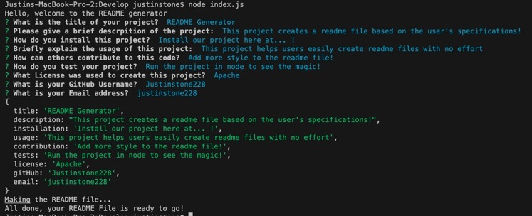

# Pro Readme Generator

## Table of Contents 
1. [Description](#description)
2.  [Visuals](#visuals)
3. [Resources](#resources)

## Author:

Justin Stone

## Description

These javascript files work to create a readme file based on the users input about the speicfications and details of their project/repository

## Visuals

## Resources
[LIVE SITE](https://justinstone2001.github.io/Code-Quiz/)

[Repository](https://github.com/Justinstone2001/Code-Quiz)

